# Part 1 - Advanced Topic Management with AI Builder Intelligence

In this lab module, you are going to understand how to create sophisticated conversation flows in Microsoft Copilot Studio using advanced topics and AI Builder for intelligent intent detection. You'll create a new "Copilot Extensibility Advisor" agent that implements dynamic topic routing based on user intent analysis. This lab demonstrates how to create intelligent agents that can automatically redirect conversations to appropriate specialized topics based on natural language understanding powered by AI Builder.

In this lab module you will learn:

- How to create and configure advanced topics in Microsoft Copilot Studio

- How to implement AI Builder models for intent classification

- How to use topic redirection for sophisticated conversation flows

- How to analyze user input with AI Builder to determine conversation paths

- How to create specialized topics for different user scenarios

#### What is Topic Redirection?

Topic redirection in Microsoft Copilot Studio is a powerful feature that allows your agent to dynamically route conversations to specific topics based on user input or conditions. Think of it like a smart traffic controller for conversations.

Imagine you have a customer service agent that can help with different types of requests - billing questions, technical support, or product information. Instead of having one massive conversation flow that handles everything, topic redirection allows you to:

Analyze user intent: Understand what the user is really asking for

Route intelligently: Direct the conversation to the most appropriate specialized topic

Maintain context: Keep track of the conversation flow and user information

Provide focused responses: Each topic can be optimized for specific scenarios

#### Benefits of AI Builder Integration

AI Builder brings advanced artificial intelligence capabilities directly into your Copilot Studio agents without requiring extensive coding knowledge. When integrated with topic management, AI Builder provides:

Natural Language Understanding: Analyze user messages to extract intent and entities

Custom Classification: Train models to recognize specific patterns in your domain

Structured Output: Get consistent, JSON-formatted responses for reliable routing decisions

Continuous Learning: Models improve over time with more data and feedback

For example, if a user says "I need help building an agent," AI Builder can analyze this request and determine whether they're interested in:

No-code/low-code solutions using Copilot Studio's visual interface

Pro-code development using Visual Studio Code and the Microsoft 365 Agents Toolkit

This intelligent analysis enables your agent to provide the most relevant help immediately.

## Exercise 1: Understanding Topic Architecture

In this exercise, you will learn about the topic structure and how to design an intelligent routing system for different user scenarios.

What are Topics in Microsoft Copilot Studio?

Topics in Microsoft Copilot Studio are modular conversation components that handle specific scenarios or user intents. They consist of:

Trigger phrases: Natural language expressions that activate the topic

Conversation flow: A series of nodes that define the interaction logic

Variables: Data storage for maintaining context throughout the conversation

Actions: Operations like calling APIs, redirecting to other topics, or performing calculations

#### Designing the Topic Architecture

For this lab, you'll create a system that helps users get appropriate guidance based on their development preferences:

Main Routing Topic ("Intent Analysis"): Analyzes user input and determines development approach preference

No-Code/Low-Code Agents: Provides guidance for agents designed with Microsoft Copilot Studio

Pro-Code Agents: Offers information about programmatic agent development with Visual Studio Code and the Microsoft 365 Agents Toolkit

The main topic will use AI Builder to analyze user messages and make intelligent routing decisions.

### Step 1: Planning the AI Builder Model

Before creating topics, let's understand what our AI Builder model needs to accomplish:

Input: User's natural language message (from Activity.Text) Processing: Analyze the message to determine development approach preference Output: JSON object with classification result

The AI Builder prompt will need to:

Understand various ways users might express interest in different development approaches

Handle ambiguous requests by asking clarifying questions

Return structured JSON for reliable topic routing

Example inputs and expected outputs:

"I want to build an agent without coding" → {"approach": "no-code/low-code"}

"How do I develop agents programmatically?" → {"approach": "pro-code"}

"I'm a developer looking for agent SDKs" → {"approach": "pro-code"}

"Can I create agents with drag and drop?" → {"approach": "no-code/low-code"}

## Exercise 2: Creating a New Agent in Copilot Studio

In this exercise, you will create a new agent in Microsoft Copilot Studio that will serve as the foundation for your intelligent topic routing system.

### Step 1: Accessing Microsoft Copilot Studio

Open the Edge browser and navigate to https://copilotstudio.microsoft.com and login with the following suggested Microsoft 365 work or school account:

If this is the very first time you run Copilot Studio you will need to select your country and to select the Get Started button.

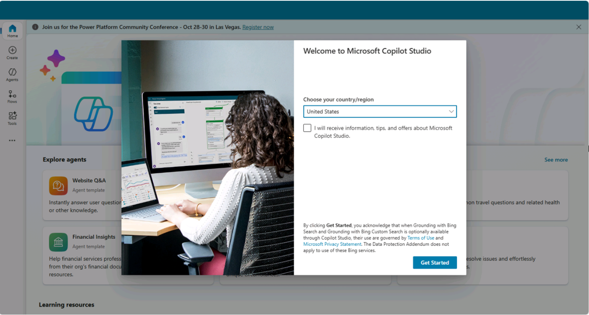

Skip, or go through, the "Welcome to Copilot Studio!" dialog window

### Step 2: Creating the new agent

After activating the Copilot Studio license, go to the left navigation menu and select Home. On the Home screen, locate the section Start building from scratch.

Select Agent. This opens the agent creation experience, where you can begin defining the agent's behavior and continue with its configuration.

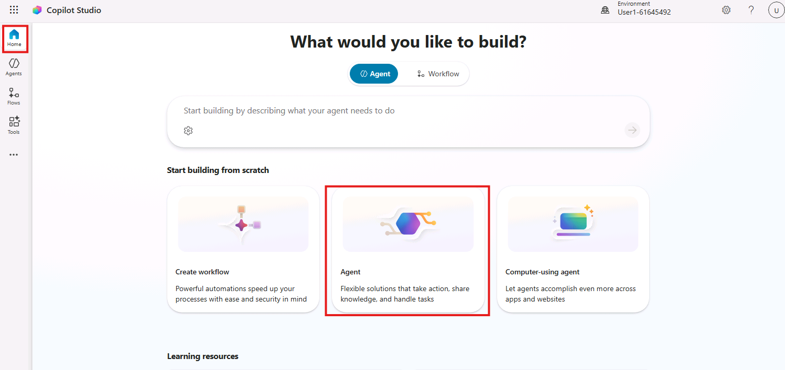

Note: If you exit the creation flow before finishing, return to Home and select Create an agent again to start a new agent setup and proceed with the configuration.

In the Name your agent tab, enter the following value:

Name:

```text
Copilot Extensibility Advisor
```

You will then be redirected to the agent screen. Wait a few seconds while the provisioning process completes.

Proceed only after you confirm the following:

A message appears at the top of the screen indicating that your agent has been provisioned.

The Publish button in the upper-right corner becomes available.

These indicators confirm that the agent environment is ready and you can continue with the configuration.

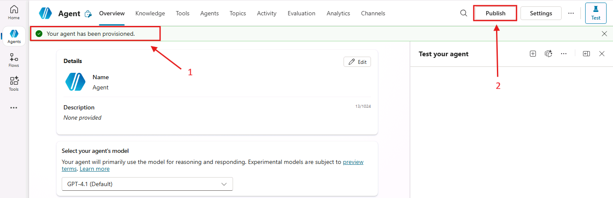

Before updating the agent details, make sure the model used by the agent is GPT-5 Chat.

Go to Select your agent's model and choose the GPT-5 Chat option.

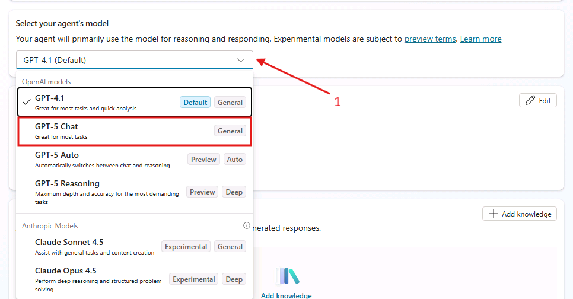

Now you need to update the basic details of your new agent. This is a multi-step process. Start by selecting Edit on the Details card (see the screenshot).

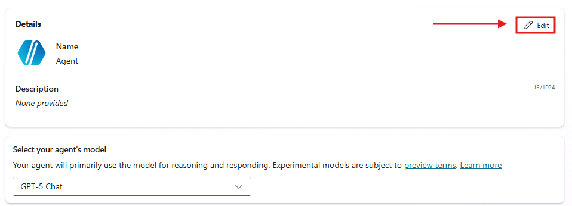

Once you select Edit, update the settings below (you can copy and paste the values):

Description:

```text
An intelligent advisor that helps users choose the best approach for extending Microsoft Copilot based on their needs and technical background
```

Once you have updated the agent details according to the settings above, select the Save button.

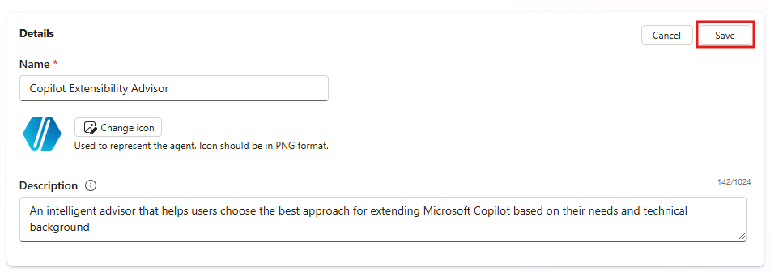

Now time to set up the instructions. Select the Edit button in the Instructions section as shown in the image.

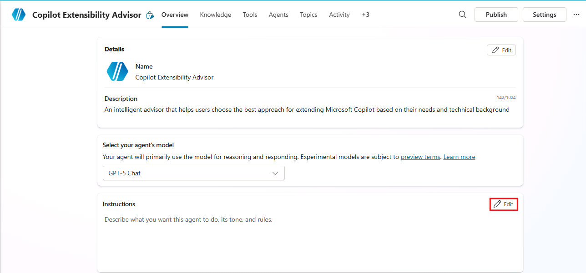

Add the Instructions below:

```text
You are an expert advisor specializing in Microsoft Copilot extensibility options. You help users understand and choose between different approaches for extending Microsoft Copilot based on their technical background, project requirements, and preferences.

You can guide users through:
- No-code/low-code solutions using Microsoft Copilot Studio visual interface
- Pro-code development using Visual Studio Code and the Agents Toolkit
- Understanding the benefits and limitations of each approach
- Getting started with their chosen development path

Always provide clear, helpful guidance and ask clarifying questions when needed to ensure users get the most appropriate recommendations for their specific use case.
```

Once the instructions have been added, select Save to store the configuration, as shown in the image.

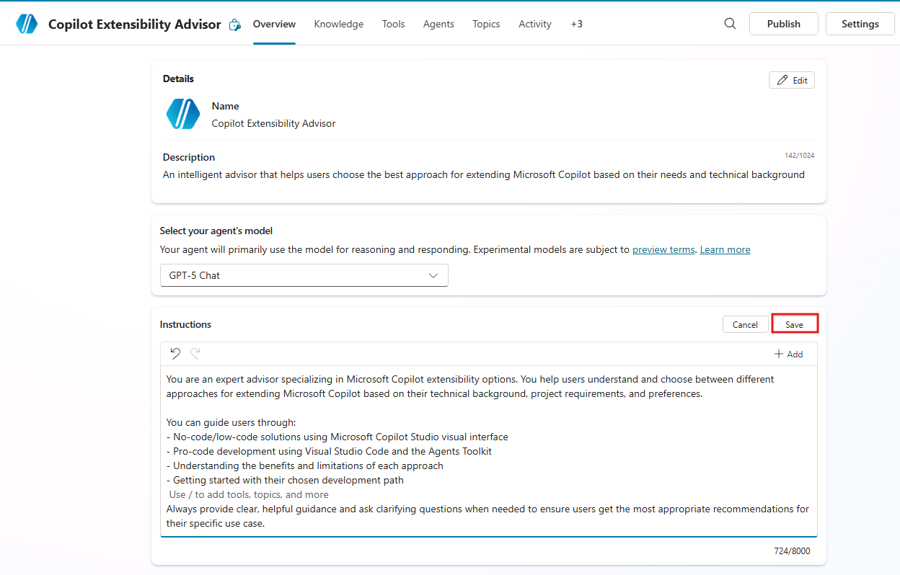

### Step 3: Configuring the agent's conversation starters

In this step you are going to configure some conversation starters, which will help users of your agent to get suggested prompts when they start using your agent.

Scroll down to the Suggested prompts section and select the Add suggested prompts button.

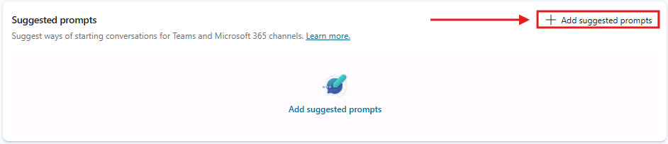

```text
Title: Get development guidance - Prompt: I want to build an agent, what are my options?
Title: No-code approach - Prompt: I want to create agents without programming
Title: Developer approach - Prompt: I am a developer looking for programmatic agent development
Title: Compare approaches - Prompt: What is the difference between no-code and pro-code agent development?
```

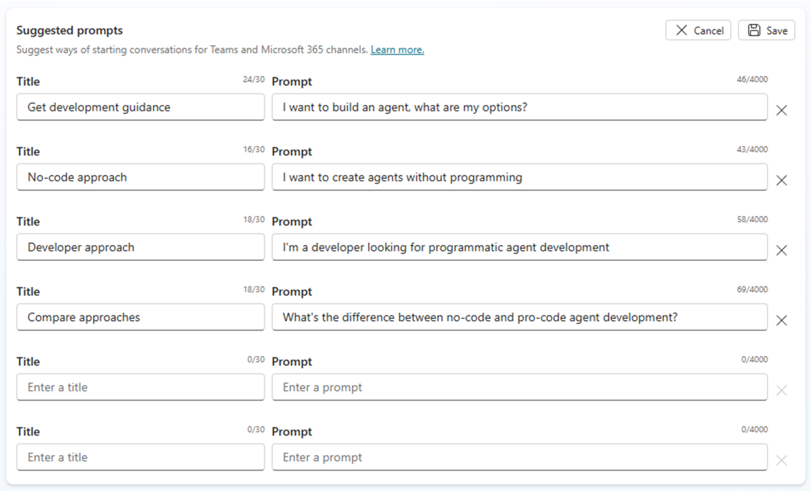

Select the Save button to confirm your changes.

### Step 4: Configuring agent settings

With the basic agent setup completed, it's now time to access the agent settings.

Select the Settings button in the upper-right corner of the screen.

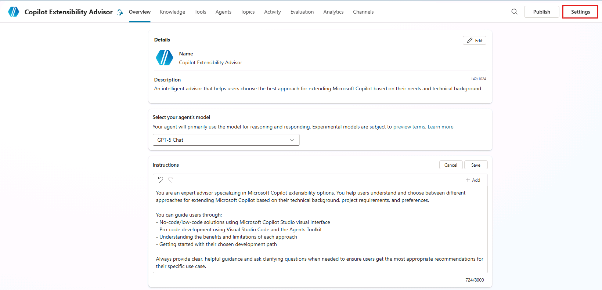

Ensure that the following settings are configured for optimal performance:

In the Orchestration section, confirm the following settings (see the image below):

Set Yes for Use generative AI orchestration for your agent's responses?

Make sure Enable advanced reasoning for AI actions is disabled.

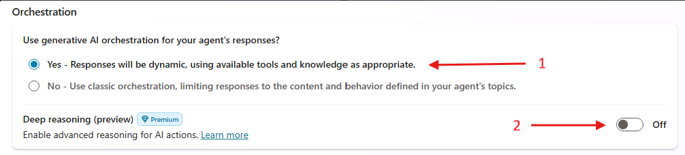

Now, using the scroll bar, move down through the options and, in the Knowledge group of settings, ensure that the following options are disabled:

Allow ungrounded responses

Use information from the Web

The Microsoft Copilot Studio settings to disable general knowledge and access to public web content.

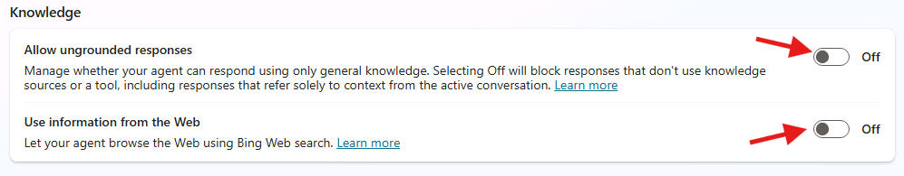

Move the scroll bar to the bottom of the screen and make sure the settings are saved by selecting the Save button to update the settings and to ensure that only the knowledge base explicitly provided to the agent will be used when processing user's prompts.

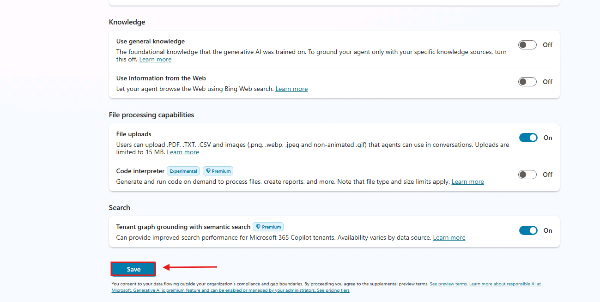

Your "Copilot Extensibility Advisor" agent is now ready to be enhanced with intelligent topic routing capabilities. Close the settings panel selecting the X icon in the upper right corner.

## Exercise 3: Creating the AI Builder Model

In this exercise, you will create and configure an AI Builder model that analyzes user intent to determine their preferred development approach.

### Step 1: Create the Intent Analysis Topic

First, create the main topic that will use AI Builder for intelligent routing:

In your "Copilot Extensibility Advisor" agent, select the Topics tab in the upper navigation of the agent designer

Select + Add a topic and choose From blank

Click the top area 1️⃣ of the dialog to give a name to the new Topic, rename it as Intent Analysis

Fill the field 2️⃣ Describe what the topic does with the following text (you can copy and paste the value):

```text
Use this topic FIRST whenever the user expresses any intent to build, create, or develop an agent or chatbot, whether no-code, low-code, or pro-code. Do NOT answer these requests directly from knowledge sources; always route them through this topic so intent can be classified. Trigger phrases: "I want to build an agent", "how do I create an agent", "I need help with agent development", "is there an SDK for building agents", "I want to develop an agent with code".
```

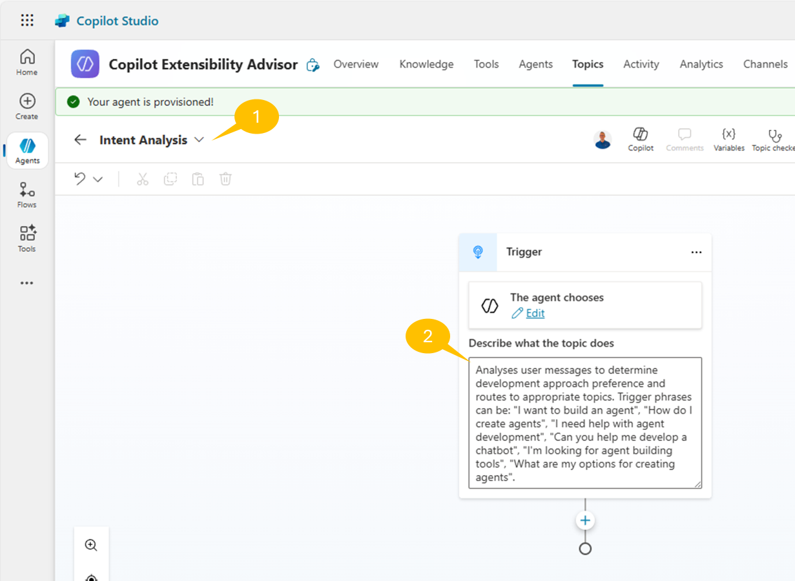

Select Save in the upper right corner of the topic designer to save the current topic.

### Step 2: Prepare the child topics

Go back to the list of Topics and create a new topic from blank. Name it 1️⃣ No-Code/Low-Code Agents, hover on the triggering area of the topic where you see The agent chooses, select the 2️⃣ icon with two arrows to configure the trigger condition, and configure the trigger as 3️⃣ It's redirected to.

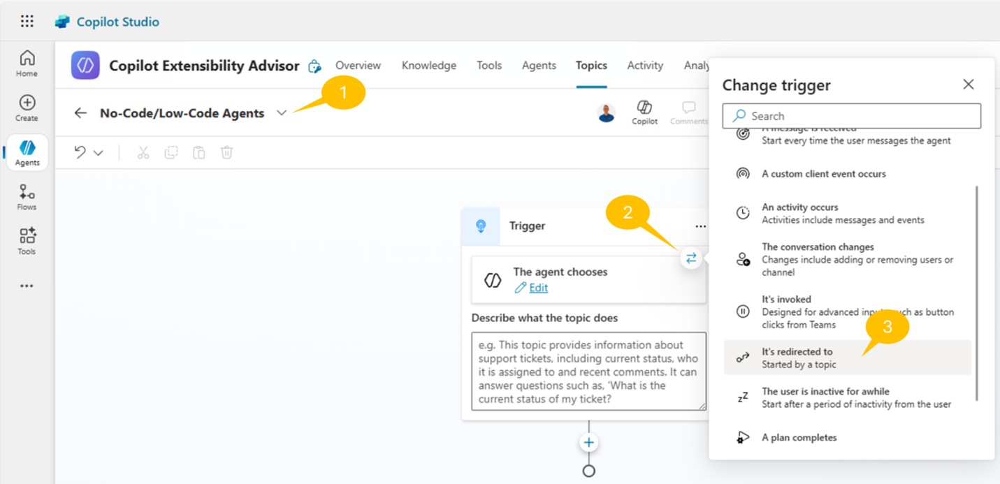

The above setting will configure the topic so that users can only reach it through another topic that redirects to it and not directly because of a specific user's prompt.

Now select the + right after the topic trigger, select to add an action of type Send a message, and configure the message with value: Cool! You want to create a no-code/low-code agent!.

Then, select the + right after the send a message action, select to add an action of type Topic Management > End all topics, to end any active topic.

Select Save in the upper right corner of the topic designer to save the current topic.

In the following screenshot you can see how the No-Code/Low-Code Agents topic looks like.

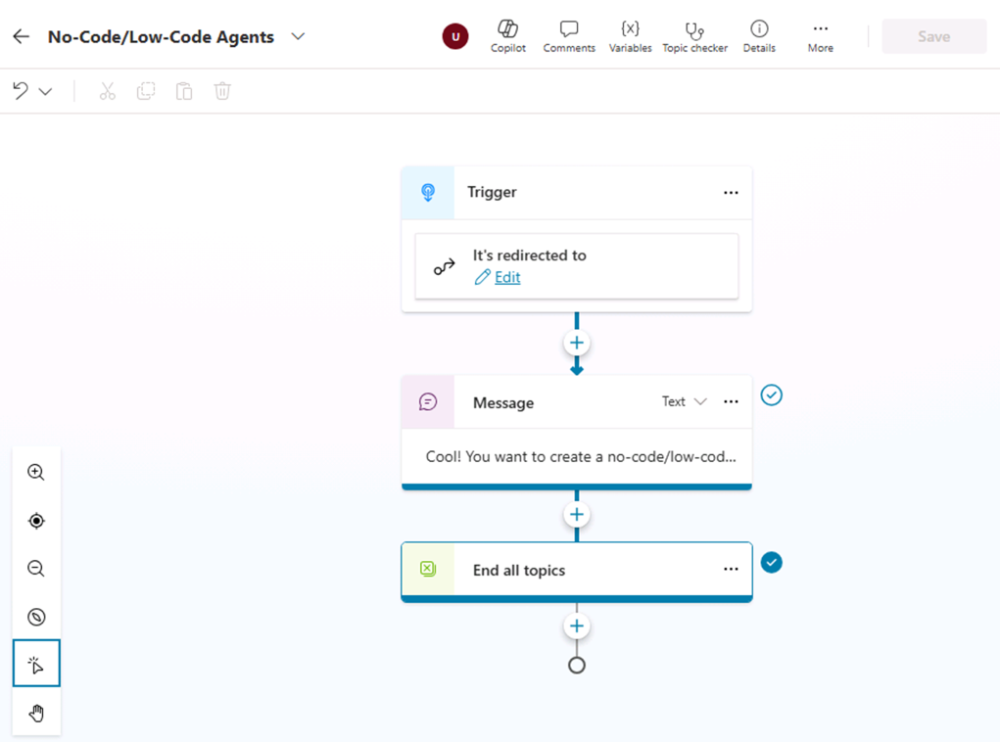

Now, follow the same steps and create yet another topic from blank with name Pro-Code Agents. Configure its trigger condition as like as the previous topic. In the Send a message action send the following message: Perfect! You want to create a pro-code agent!. Remember to add the End all topics action at the end, to end all the active topics. Select Save in the upper right corner of the topic designer to save the current topic.

> **Note:** In the Part 2 of this lab you will come back to this topics and you will improve them with the Generative Answers action.

### Step 3: Use AI Prompt Builder

Now add the New Prompt action to the topic Intent Analysis in order to leverage the AI Builder capabilities.

Select the 1️⃣ + command to add a new action to the topic

Select 2️⃣ Add a tool to open the list of tools

In the list of Basic tools select 3️⃣ New prompt

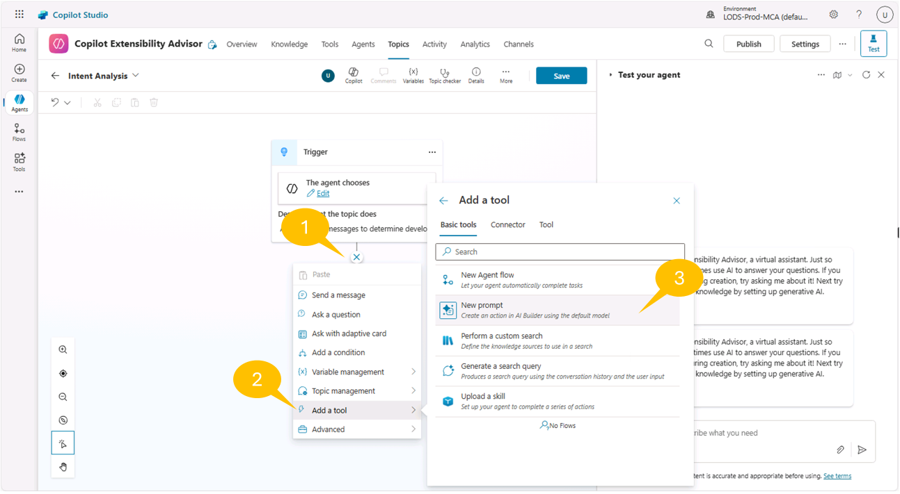

In case you see an error message stating that the functionality is not available for you, stop working on the current step, delete the "Prompt Builder" action that you just created, and move to "Step 5: Use manual redirection (optional)"

A new dialog window shows up allowing you to build a new prompt. Click the 1️⃣ top area of the dialog to give a name to the new prompt. For example name it User's intent analysis. Remember to use a unique name, for example add your alias to the end of the name, to make it unique.

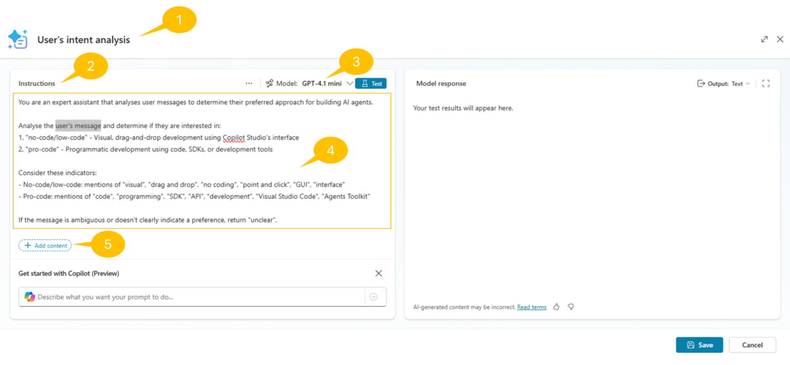

In the 2️⃣ Instructions section you can select the 3️⃣foundational model that you want to use. Available options are:

GPT-5 chat

GPT-5 reasoning

In the 4️⃣ yellow square in the image above, located below the model selection section, you can enter the instructions for your new prompt.

For example, use the following text (you can copy and paste the value):

```text
You are an expert assistant that analyses user messages to determine their preferred approach for building AI agents.

Analyze the [user's message] and determine if they are interested in:
1. "no-code/low-code" - Visual, drag-and-drop development using Copilot Studio's interface
2. "pro-code" - Programmatic development using code, SDKs, or development tools

Consider these indicators:
- No-code/low-code: mentions of "visual", "drag and drop", "no coding", "point and click", "GUI", "interface", "Copilot Studio", "Agent Builder", "maker", "no-code", "low-code"
- Pro-code: mentions of "code", "programming", "SDK", "API", "development", "Visual Studio Code", "Agents Toolkit"

If the message is ambiguous or doesn't clearly indicate a preference, return "unclear".

Always respond with valid JSON in this exact format:
{"approach": "no-code/low-code"}
or
{"approach": "pro-code"}
or
{"approach": "unclear"}

Do not include any additional text or explanation outside the JSON response.
```

Select the words [user's message] at the top of the instructions and select 5️⃣ + Add content just below the instructions text.

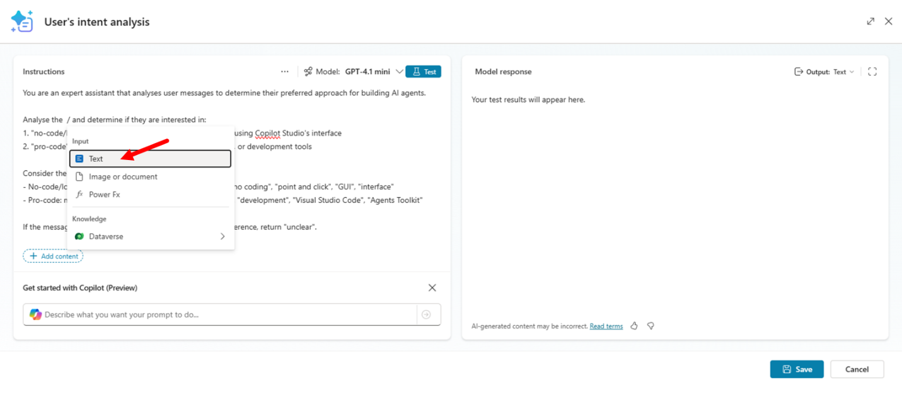

Select the option Text in popup dialog in order to insert a new text input field, which will be used to feed the AI Builder instructions with dynamic data provided by the topic. When configuring the input field, name the field as user's message and provide the following Sample data: I want to build an agent using the Microsoft 365 Agents SDK.

As you can see from the user interface, you can have different type of input fields like:

Text: to add a text based input

Image or document: to add an image or a document to process

PowerFx: to add a PowerFx formula

Dataverse: to use a Dataverse table of records

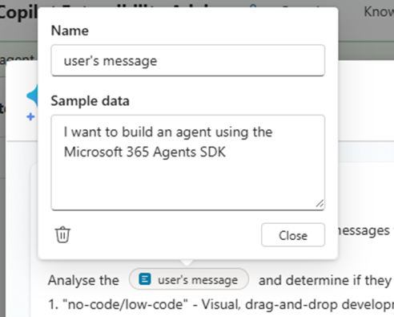

IMPORTANT: In the upper right corner of the AI Builder dialog, the output format must be set as JSON to see the text properly formatted and to instruct Copilot Studio that the output will be a structured JSON.

Now, select Test to validate the output of the prompt using the sample data that you just configured for the input field. Accordingly to the prompt instructions, the Model response will be a JSON message, so configure the Output of the model accordingly.

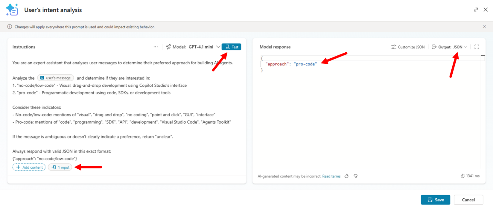

Select the Save command in the lower right side of the dialog to save the generated prompt and to go back to the topic designer.

When you are back to the topic designer, select the Inputs variable of the Prompt Builder action and select the 1️⃣ … three dots to bind a variable, then select the 2️⃣ group of System variables, and then select 3️⃣ Activity.Text, which represents the input prompt provided by the user.

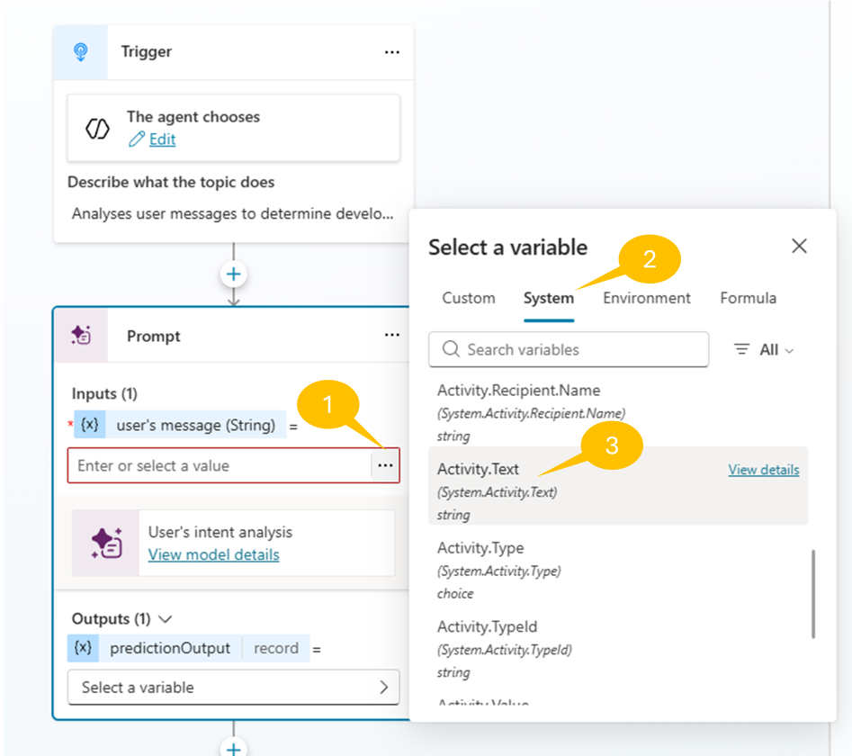

Then, configure a new variable to hold the output of the Prompt Builder action. To do so, click on the 1️⃣ Select a variable area in the Outputs section of the action. Then select the 2️⃣ Create new command to create a new variable.

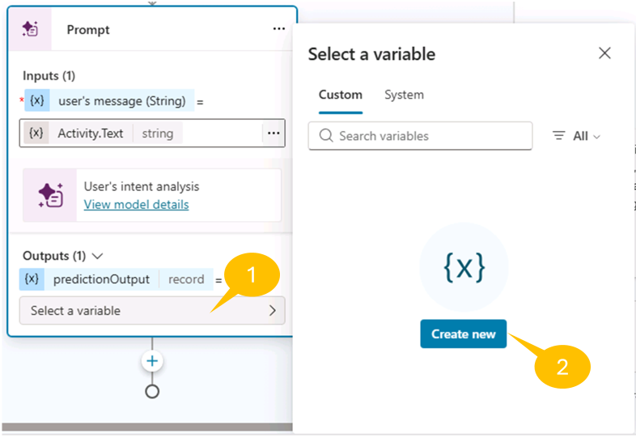

Copilot Studio will create a new variable with name Var1. Select the name of the variable 1️⃣ in the action to open a panel, on the right side. From the panel you can rename the variable from 2️⃣ Var1 to intentPrediction.

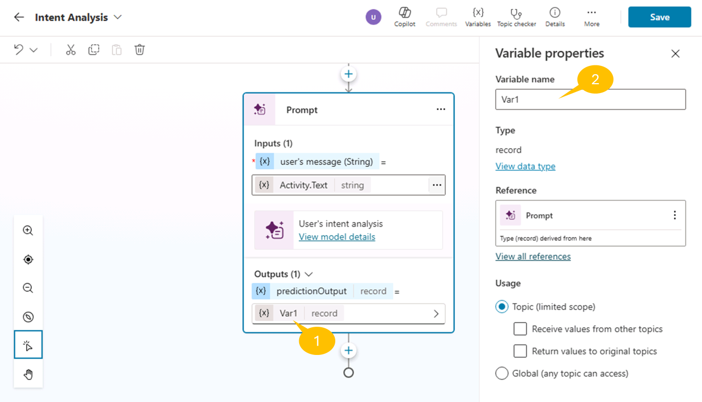

Select Save in the upper right corner of the topic designer to save the current topic.

### Step 4: Building the Conversation Flow

At the end of the Intent Analysis topic, right after the Prompt Builder, Insert a new action of type Set a variable value, under the group Variable management.

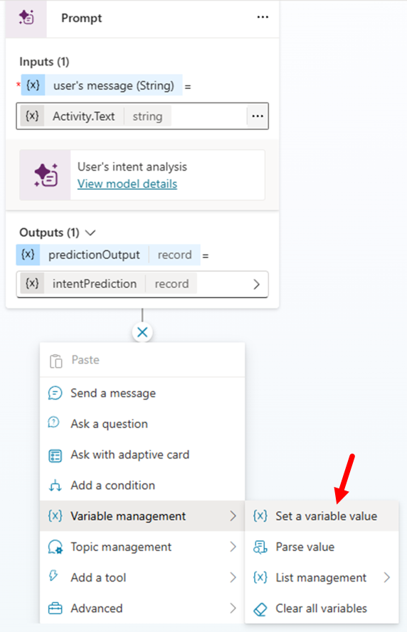

Select the 1️⃣ Set variable field, then select to 2️⃣ Create a new variable. Select the new Var1 variable to show the side panel and rename it 3️⃣ to approach.

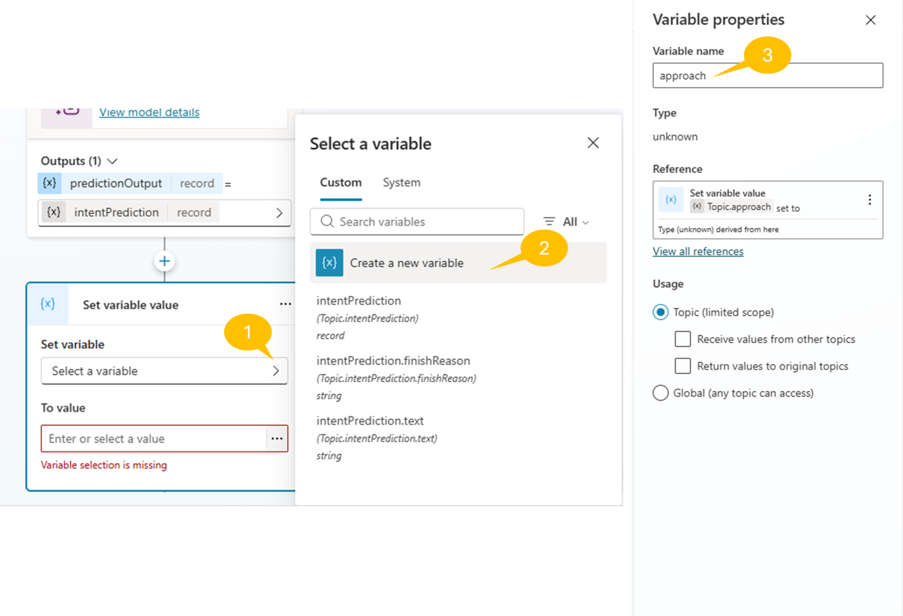

Now, select the To value field of the action and set its value to the following PowerFx formula:

Topic.intentPrediction.structuredOutput.approach

The above syntax instructs Copilot Studio to assign to the variable the actual value of the approach property in the JSON response that comes back from the Prompt Builder action.

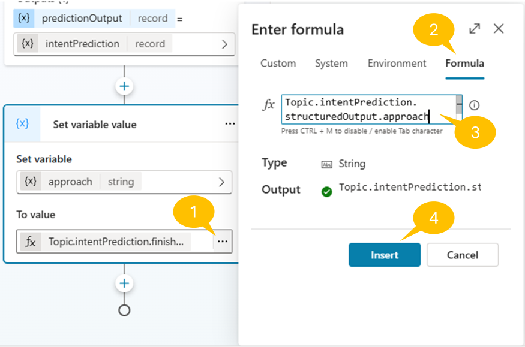

It is now time to evaluate the variable to determine where to redirect the user. Add a new action of type Add a condition to the topic and configure three branches accordingly to the following settings:

#### No-code/low-code branch

Name the first branch on the left with name 1️⃣ No-code/low-code

Click on 2️⃣ Select a variable and select the approach variable

Set the condition to 3️⃣ is equal to and set the value to compare to 4️⃣ no-code/low-code

Select the 5️⃣+ button to add a new action inside the branch. Select the group of actions with name Topic management, then Go to another topic, and then select the topic with name No-Code/Low-Code Agents

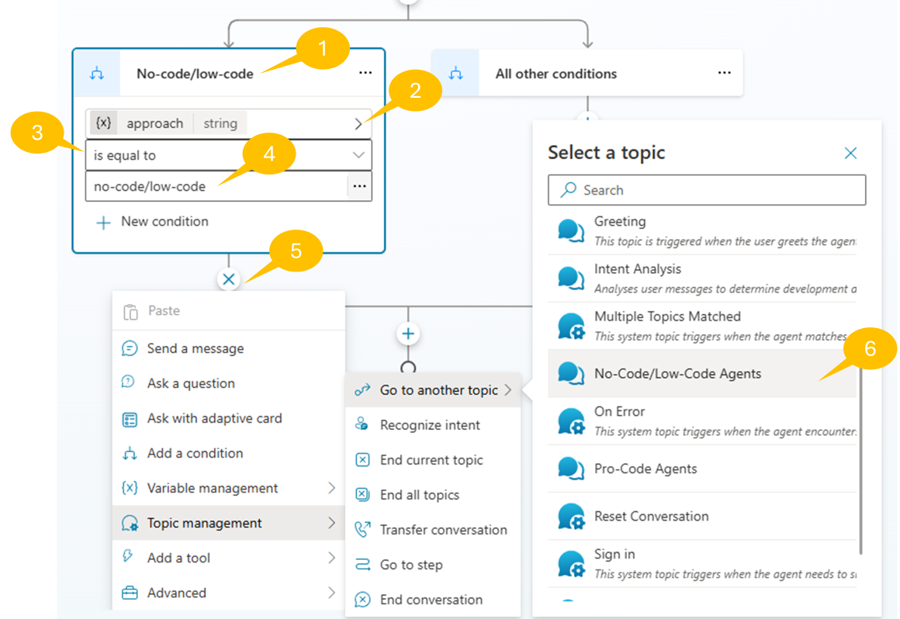

#### Pro-code branch

Select the + icon just before the conditional block and select Add a condition to add a new branch

Name the new branch with name Pro-code

Click on Select a variable and select the approach variable

Set the condition to is equal to and set the value to compare to pro-code

Select the + button to add a new action inside the branch. Select the group of actions with name Topic management, then Go to another topic, and then select the topic with name Pro-Code Agents

#### All other conditions

Select the + icon and add a new action inside the branch on the right side with name All other conditions

Add an action of type Send a message and simply write the following message: I'm sorry! Your input is unclear!

Right after the conditional branch, add an action of type End current topic, which is available in the group of Topic management actions.

Select Save to save the updates definition of the Intent Analysis topic.

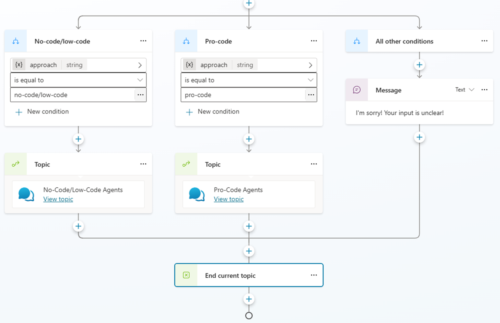

## Exercise 4: Testing the conversational flow

In this exercise, you will test your intelligent topic routing system to ensure it correctly analyzes user intent and routes conversations to the appropriate specialized topics.

### Step 1: Publishing and Testing the Agent

Before testing, ensure your agent is published and ready for interaction:

Select Publish in the upper right corner of Copilot Studio and wait for the publishing process to complete.

Once published, select Test to open the test panel on the right side of the screen.

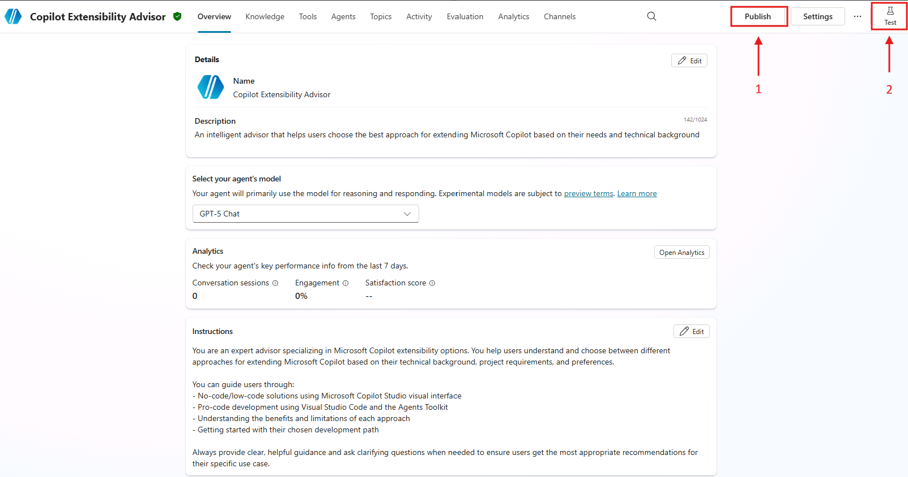

### Step 2: Testing No-Code/Low-Code Routing

Test the routing to the "No-Code/Low-Code Agents" topic with these sample prompts:

#### Test Case 1: Clear No-Code Intent

I want to create an agent but I am not a developer

Expected Result: The agent should analyze the message, determine it's a no-code/low-code request, and route to the "No-Code/Low-Code Agents" topic, displaying the message "Cool! You want to create a no-code/low-code agent!"

#### Test Case 2: Developer-focused Request

Is there any SDK for building conversational agents?

Expected Result: The agent should identify this as a pro-code request and route to the "Pro-Code Agents" topic, displaying "Perfect! You want to create a pro-code agent!"

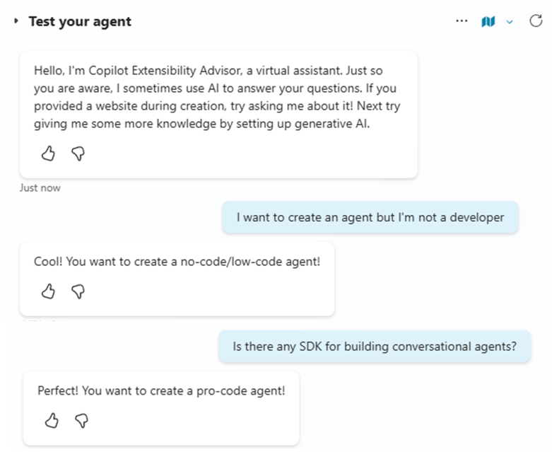

Congratulations! You have successfully built an intelligent topic routing system that leverages AI Builder for sophisticated conversation management in Microsoft Copilot Studio.
